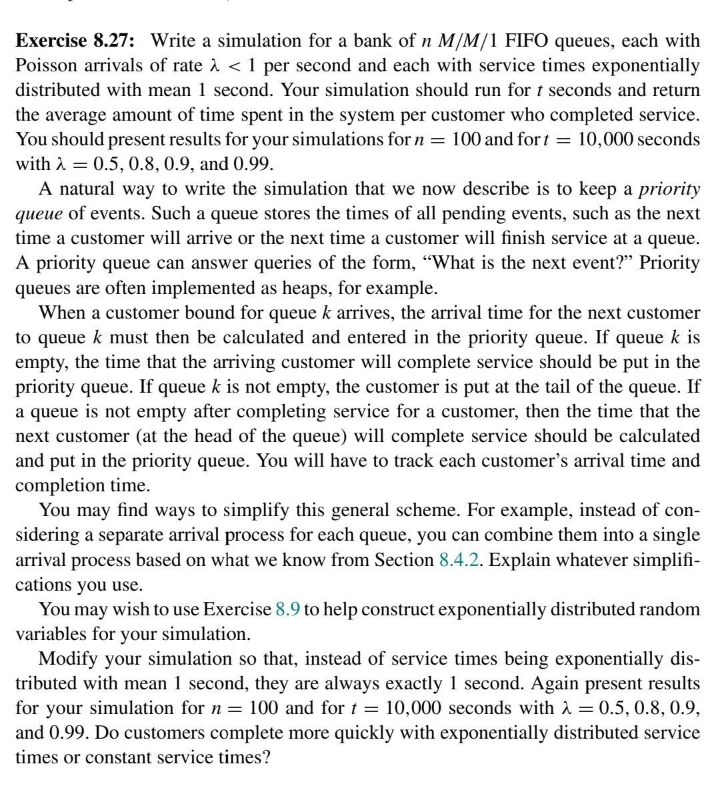

# Fila M/M/1
Um sistema de fila M/M/1 é caracterizado por chegadas de clientes seguindo um processo de Poisson, tempos de serviço exponencialmente distribuídos, e um único servidor. A simulação tem como objetivo avaliar o desempenho do sistema em termos de tamanho médio da fila e tempo médio de resposta para diferentes taxas de chegada (λ).

Este repositório tem como objetivo resolver a seguinte questão:




## Execução
Para executar a simulação, basta rodar o script `main.py`.

```bash
python3 main.py
```

## Resultados
```python3
{0.5: {'simulation': 1.99, 'response_time': 2.0},
 0.8: {'simulation': 4.96, 'response_time': 5.0},
 0.9: {'simulation': 9.52, 'response_time': 10.0},
 0.99: {'simulation': 49.26, 'response_time': 100.0}}
-----
{0.5: {'simulation': 1.5, 'response_time': 2.0},
 0.8: {'simulation': 3.02, 'response_time': 5.0},
 0.9: {'simulation': 5.49, 'response_time': 10.0},
 0.99: {'simulation': 32.93, 'response_time': 100.0}}
 ```

Este é o resultado de uma simulação para diferentes taxas de chegada (λ). É possível observar que o tempo médio de jobs servidos, que é representado por `simulation` se aproxima do valor teórico do tempo de resposta que é representado por `response_time`.